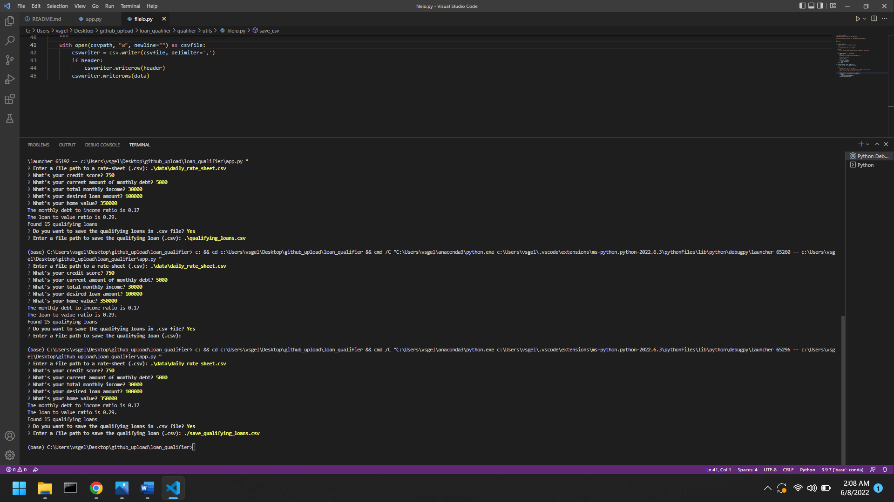

# Loan Qualifier

The purpose of this application is to determine if an applicant qualifies for a list of loans based on the applicant input in the command line interface. If the applicant doesn't qualify for a loan, the application will say so. The application will ask the user if they want to save a list of qualifying loans in a .csv file.

---

## Technologies

This project leverages python 3.9 with the following packages:

* [fire](https://github.com/google/python-fire) - For the command line interface, help page, and entry-point.

* [questionary](https://github.com/tmbo/questionary) - For interactive user prompts and dialogs

---

## Installation Guide

Before running the application first install the following dependencies.

```
 pip install fire
 pip install questionary
```
---


## Usage


To use the loan qualifier application simply clone the repository and run the **app.py** with:

```python
python app.py
```

Upon launching the loan qualifier application you will be greeted with the following prompts.



---

## Contributors

THis program was brought to you by Vic Gellon vsgellon@gmail.com

---

## License

This software is not licensed. 
